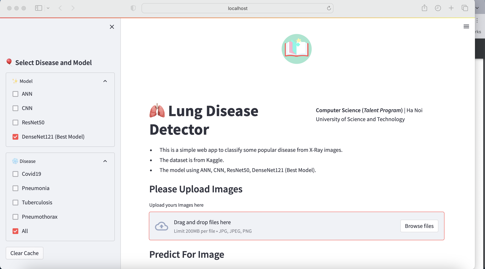

# AI-Project-2022

## Authors

[LongNguyen](https://github.com/ndlongvn), [LuongHo](https://github.com/LuongHvd), [TruongPham](https://github.com/giacatxt), [ThuNgo](https://github.com/superyogurt)

## Content
[Deep Learning](#deep-learning)
- [Introduction](#introduction)
- [How to install the environment](#how-to-install-environment)
- [How to prepare the dataset](#how-to-prepare-dataset)
- [How to train and test](#how-to-train-and-test)
- [How to using this app](#how-to-using-this-app)

[Model](#model)

[Citation](#citation)

[Contact](#contact)

## Deep Learning
### Introduction

This is the respository of ours AI project using CNN-based model as CNN, ResNet50, VGG16, DenseNet121 and InceptionV3 to diagnose some popular lung diseases. In this repository, we provide training code, pre-trained models, network settings for AI model. We also provide an app to use our model to diagnose lung diseases. 

By using this repository, you can achieve a performance of 91% accuracy on the test set of our dataset. Therefor you can use our model to diagnose lung diseases with high accuracy.

### How to install environment

1. Clone the repository into a directory. We refer to that directory as *AI-PROJECT-ROOT*.

```Shell
git clone https://github.com/ndlongvn/AI-Project-2022.git
```

2. Install all required packages.

```Shell
pip install -r requirements.txt
```

### How to prepare dataset

1. Download dataset from Kaggle and put it into <a href="https://github.com/ndlongvn/AI-Project-2022/tree/main/data">data</a> folder:
    - [Covid19 Dataset](http://www.kaggle.com/datasets/prashant268/chest-xray-covid19-pneumonia)
    - [Tuberculosis Dataset](https://www.kaggle.com/datasets/tawsifurrahman/tuberculosis-tb-chest-xray-dataset)
    - [Pneumonia Dataset](https://www.kaggle.com/datasets/paultimothymooney/chest-xray-pneumonia)
    - [Pneumothorax Dataset](https://www.kaggle.com/datasets/vbookshelf/pneumothorax-chest-xray-images-and-masks)
2. Using code from <a href="https://github.com/ndlongvn/AI-Project-2022/blob/main/scripts/data_preprocess.py">data preprocess</a> to prepare dataset.


### How to train and test
1. You can use code from <a href="https://github.com/ndlongvn/AI-Project-2022/tree/main/notebooks">notebooks</a> to train model. Some model code is provided in this folder and you can use it to train model as:
    - [ANN](https://github.com/ndlongvn/AI-Project-2022/blob/main/notebooks/ANN.ipynb)
    - [CNN](https://github.com/ndlongvn/AI-Project-2022/blob/main/notebooks/CNN.ipynb)
    - [InceptionV3 + VGG16 + ResNet50 + DenseNet121](https://github.com/ndlongvn/AI-Project-2022/blob/main/notebooks/Finetune.ipynb)
    - [EDA](https://github.com/ndlongvn/AI-Project-2022/blob/main/notebooks/EDA.ipynb) 
2.  Resume from last checkpoint.
You can load the checkpoint from <a href="https://github.com/ndlongvn/AI-Project-2022/tree/main/checkpoints">checkpoints</a> folder to test or resume training.

### How to using this app
1. Access to cloned folder from GitHub and install all requirements:
```Shell
pip install -r requirements.txt
```
2. Download checkpoints from [Model Checkpoints](#model) and put it into <a href="https://github.com/ndlongvn/AI-Project-2022/tree/main/checkpoints">checkpoints</a> folder.
3. Run app:
```Shell
streamlit run src/main.py
```

### Model

<details open>

<summary>Table. Model Checkpoints.</summary>

<p> </p>

|           Architecture        |   Acc (%) |                                            Url                                           | Size (MB)|
|:-----------------------------:|:--------:|:----------------------------------------------------------------------------------------:|:--------:|
|ANN |   56  |[GoogleDrive](https://drive.google.com/file/d/1gVAakBi_hr5Q5IMKHJZwEE_UjjwojVgY/view?usp=drive_link) |    97  |
|CNN        |   87  |[GoogleDrive](https://drive.google.com/file/d/1U1qMT7jLaRvfAL7QPqt6xJ-BccoqqWxC/view?usp=drive_link) |    56  |
|InceptionV3       |   88  |[GoogleDrive](https://drive.google.com/file/d/1MKnFLCrOY251ClDGsHI9WiYUpeLZFo6D/view?usp=drive_link) |    85  |
|ResNet50        |   90   |[GoogleDrive](https://drive.google.com/file/d/13IDUZwuPN3msVN-Rx3BsBQ23UlACsuO6/view?usp=drive_link) |    91  |
|DenseNet121|   91   |[GoogleDrive](https://drive.google.com/file/d/12PTu5_CjryaFT0RaHZqIipjnwthv_eXJ/view?usp=drive_link) |    28   |

</details>

### Citation

```bibtex
@article{HuangLW16a2016DBLP,
  author       = {Gao Huang and
                  Zhuang Liu and
                  Kilian Q. Weinberger},
  title        = {Densely Connected Convolutional Networks},
  journal      = {CoRR},
  volume       = {abs/1608.06993},
  year         = {2016},
  url          = {http://arxiv.org/abs/1608.06993},
  eprinttype    = {arXiv},
  eprint       = {1608.06993},
  timestamp    = {Mon, 10 Sep 2018 15:49:32 +0200},
  biburl       = {https://dblp.org/rec/journals/corr/HuangLW16a.bib},
  bibsource    = {dblp computer science bibliography, https://dblp.org}
}
@article{bento2021multilayer,
  title={Multilayer Perceptron explained with a real-life example and python code: Sentiment analysis},
  author={Bento, Carolina},
  journal={Towards Data Science},
  year={2021}
}
@article{miyashita2022atypical,
  title={Atypical pneumonia: Pathophysiology, diagnosis, and treatment},
  author={Miyashita, Naoyuki},
  journal={Respiratory investigation},
  volume={60},
  number={1},
  pages={56--67},
  year={2022},
  publisher={Elsevier}
}
@article{huan2021pneumothorax,
  title={Pneumothorax: classification and etiology},
  author={Huan, Nai-Chien and Sidhu, Calvin and Thomas, Rajesh},
  journal={Clinics in chest medicine},
  volume={42},
  number={4},
  pages={711--727},
  year={2021},
  publisher={Elsevier}
}
@book{goodfellow2016deep,
  title={Deep learning},
  author={Goodfellow, Ian and Bengio, Yoshua and Courville, Aaron},
  year={2016},
  publisher={MIT press}
}
```

### Contact
If you have any question, please contact us via email:
- Long Nguyen: long.nd204580@sis.hust.edu.vn
- Luong Ho: luong.hvd200376@sis.hust.edu.vn
- Truong Pham: truong.px200655@sis.hust.edu.vn
- Thu Ngo: thu.nta200623@sis.hust.edu.vn


```
